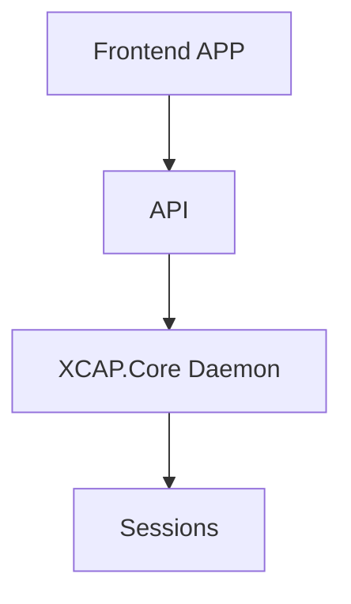
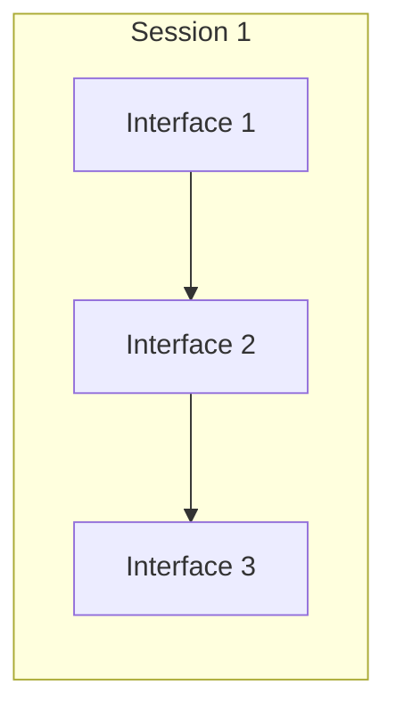
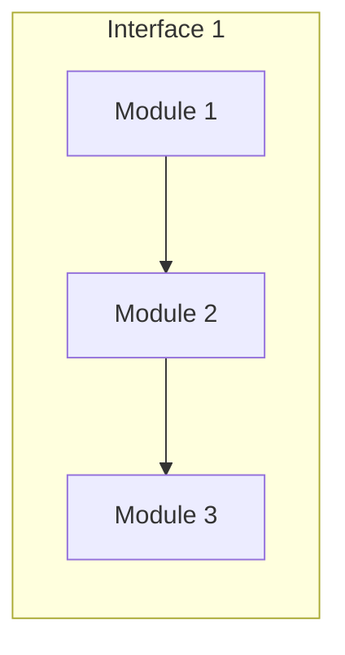

# Design

## Front-end app

In general, the **front end** is the presentation layer of our application. It’s often described as all the stuff the user sees, but more generally, it’s any code that’s responsible for efficiently displaying data to the user. So, the front end includes building intuitive and pleasant interfaces, as well as efficiently storing, presenting, and updating data received from the back end or API. 
The user interface is implemented using React.js.
**React.js** is an **open source JavaScript library** used for front end development, which was developed by Facebook. Its component-based library allows us to build high-quality user-interfaces for web apps.

## API

API - Application programming interface is a set of definitions and protocols for building and integrating application software. 
**GraphQL** is an open-source data query and manipulation language for [APIs](https://en.wikipedia.org/wiki/Application_programming_interface "Application programming interface"), and a runtime for fulfilling queries with existing data.

## XCAP.Core Daemon

Daemons are processes that are often started when the system is bootstrapped and terminate only when the system is shut down.
**XCAP.Core Daemon** stitches all the processes together while it runs in the background. It acts as a p process manager and manages the interfaces and sessions.
<!--stackedit_data:
eyJoaXN0b3J5IjpbLTY5Mjg2OTQxNSwyMDcwMTE0ODU1LC0xOD
gwMjM0NjE2LC02MzQzMzk1NDIsMTgxNTIxNzAxNCwtOTE1ODQx
NjMzLC02MDMzNTMyODYsLTE0MTg1ODU5MjEsLTE1Njk4MjE0MT
QsLTE4MjI3NDIwMzYsNzUwNzQwMTUwLDMyMzUxMDQ1Niw1MjUz
MjQ3ODVdfQ==
-->