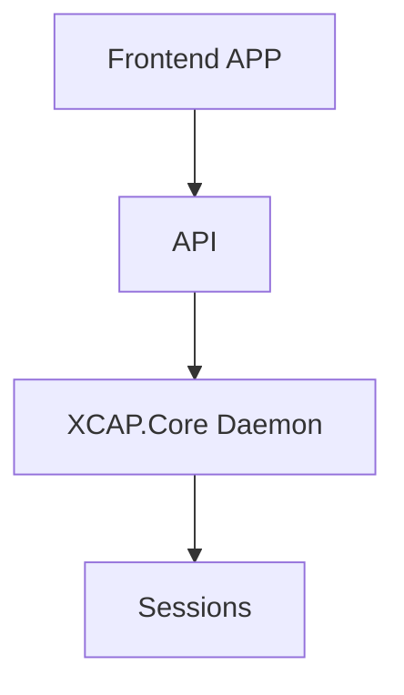
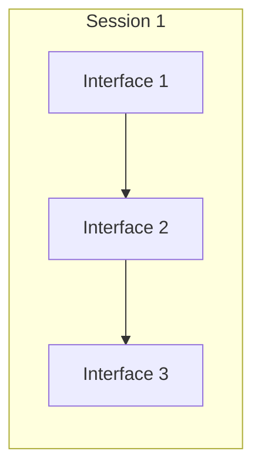
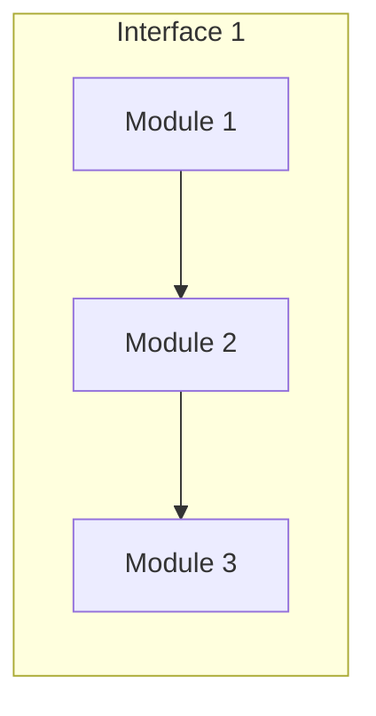

# Design

## Front-end app

In general, the **front end** is the presentation layer of our application. It’s often described as all the stuff the user sees, but more generally, it’s any code that’s responsible for efficiently displaying data to the user. So, the front end includes building intuitive and pleasant interfaces, as well as efficiently storing, presenting, and updating data received from the back end or API. 
The user interface is implemented using React.js.
**React.js** is an **open source JavaScript library** used for front end development, which was developed by Facebook. Its component-based library allows us to build high-quality user-interfaces for web apps.

## API

An API **A**pplication **p**rogramming **i**nterface is a set of definitions and protocols for building and integrating application software.
**GraphQL** is an open-source data [query](https://en.wikipedia.org/wiki/Query_language "Query language") and [manipulation](https://en.wikipedia.org/wiki/Data_manipulation_language "Data manipulation language") language for [APIs](https://en.wikipedia.org/wiki/Application_programming_interface "Application programming interface"), and a runtime for fulfilling queries with existing data.
<!--stackedit_data:
eyJoaXN0b3J5IjpbLTE4NjkzMDg0MjYsLTE0MTg1ODU5MjEsLT
E1Njk4MjE0MTQsLTE4MjI3NDIwMzYsNzUwNzQwMTUwLDMyMzUx
MDQ1Niw1MjUzMjQ3ODVdfQ==
-->