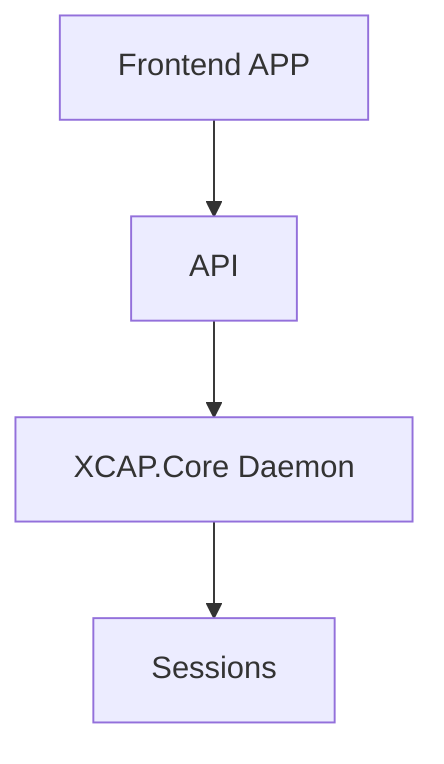
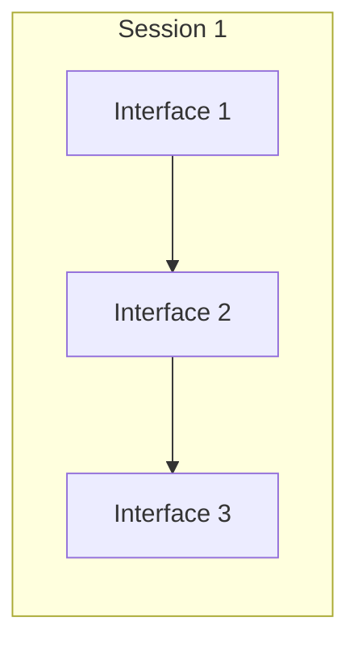
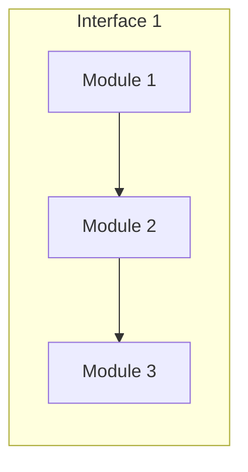

# Design

```mermaid
graph TB
frontend["Frontend APP"]
api["API"]
core["XCAP.Core Daemon"]

frontend --> api
api --> core
core --> Sessions
```

```mermaid
graph LR
int1["Interface 1"]
int2["Interface 2"]
int3["Interface 3"]
subgraph Session 1
int1 -->int2
int2 --> int3
end
```

```mermaid
graph LR
int1["Module 1"]
int2["Module 2"]
int3["Module 3"]
subgraph Interface 1
int1 -->int2
int2 --> int3
end
```

<!--stackedit_data:
eyJoaXN0b3J5IjpbMzIzNTEwNDU2LDUyNTMyNDc4NV19
-->