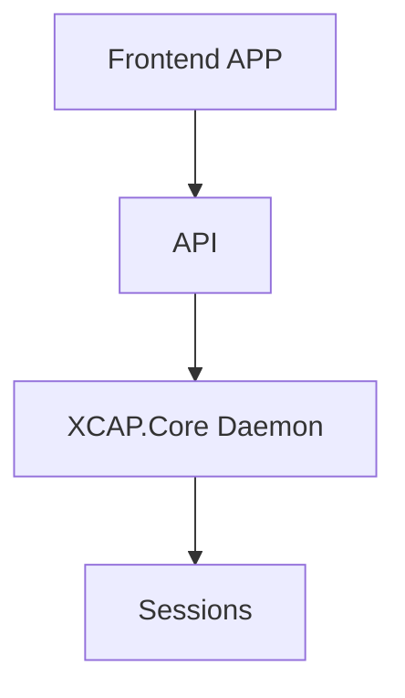
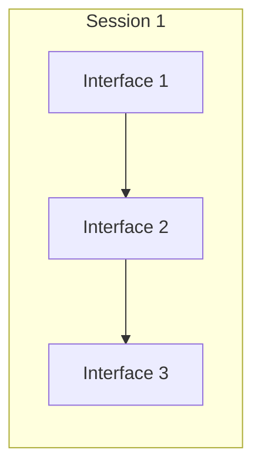
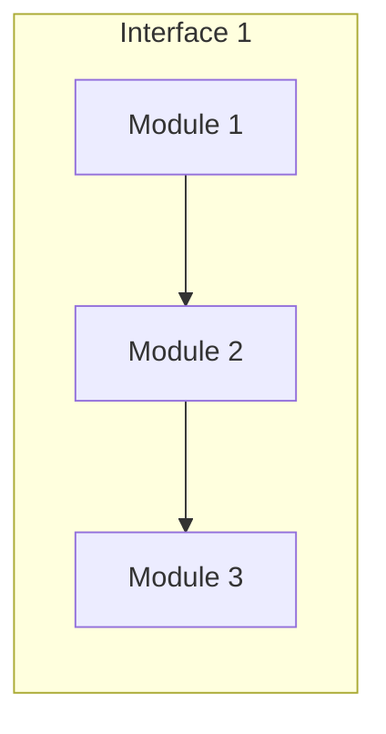

# Design

## Front-end framework

In general, a **front-end framework** is a scaffold for building the front end. A **front end** is the presentation layer of our application. It’s often described as all the stuff the user sees, but more generally, it’s any code that’s responsible for efficiently displaying data to the user. So, the front end includes building intuitive and pleasant interfaces, as well as efficiently storing, presenting, and updating data received from the back end or API. 
<!--stackedit_data:
eyJoaXN0b3J5IjpbMTgwNzYyNjA0NCw3NTA3NDAxNTAsMzIzNT
EwNDU2LDUyNTMyNDc4NV19
-->