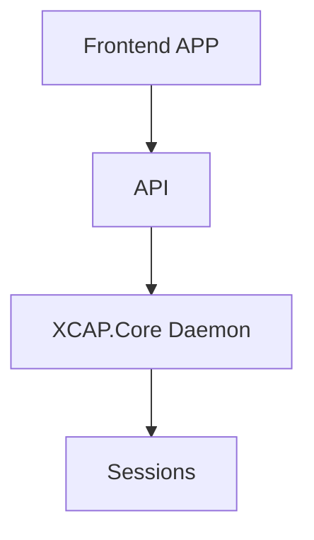
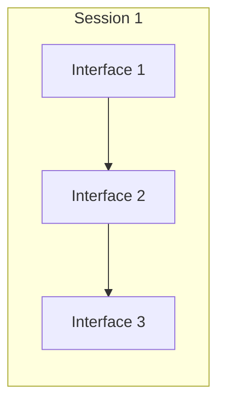
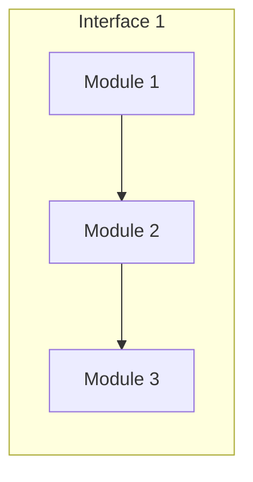

# Design

## Front-end framework

In general, a **front-end framework** is a scaffold for building the front end. It usually includes some way to structure files
<!--stackedit_data:
eyJoaXN0b3J5IjpbMzkwOTIyNzcyLDc1MDc0MDE1MCwzMjM1MT
A0NTYsNTI1MzI0Nzg1XX0=
-->