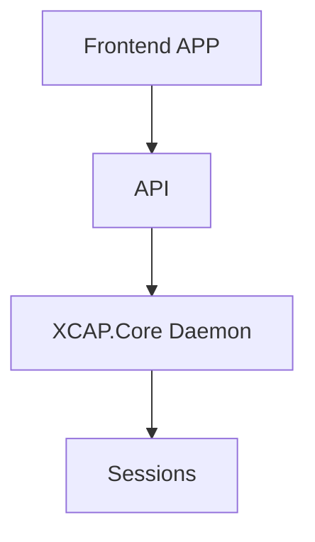
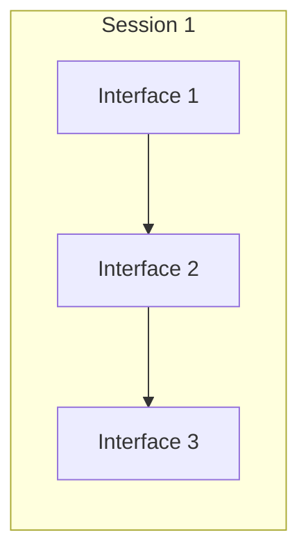
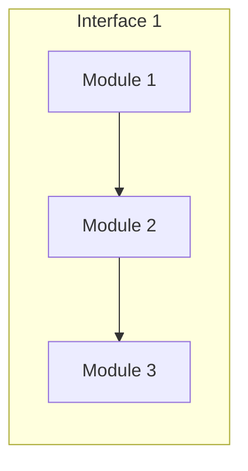

# Design

## Front-end app

In general, the **front end** is the presentation layer of our application. It’s often described as all the stuff the user sees, but more generally, it’s any code that’s responsible for efficiently displaying data to the user. So, the front end includes building intuitive and pleasant interfaces, as well as efficiently storing, presenting, and updating data received from the back end or API. 
The user interface is implemented using React.js.
**React.js** is an **open source JavaScript library** used for front end development, which was developed by Facebook. Its component-based library allows us to build high-quality user-interfaces for web apps.

## API

An API **a**pplication **p**rogramming **i**nterface is a set of definitions and protocols for building and integrating application software.
<!--stackedit_data:
eyJoaXN0b3J5IjpbNTYzNDI0MjkzLC0xNDE4NTg1OTIxLC0xNT
Y5ODIxNDE0LC0xODIyNzQyMDM2LDc1MDc0MDE1MCwzMjM1MTA0
NTYsNTI1MzI0Nzg1XX0=
-->