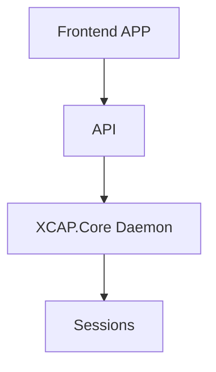
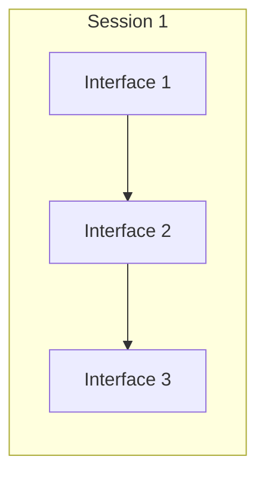
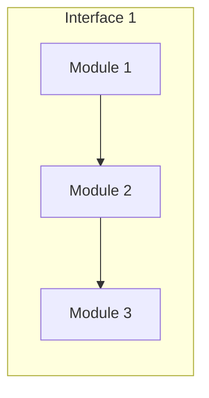

# Design

This framework is built of multiple interfaces for each individual program in the crystallography process. Each interface is built of individual modules which are further comprised of sets of scripts and functions. The interfaces allow a set of i/p files and generates the output to the next interface in the pipeline.

<!--stackedit_data:
eyJoaXN0b3J5IjpbNTI4MTI3ODA4LDMyMzUxMDQ1Niw1MjUzMj
Q3ODVdfQ==
-->