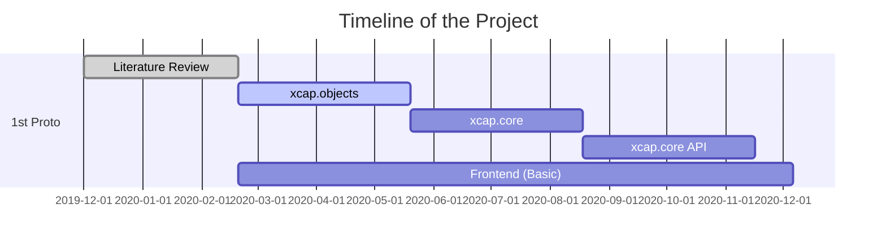
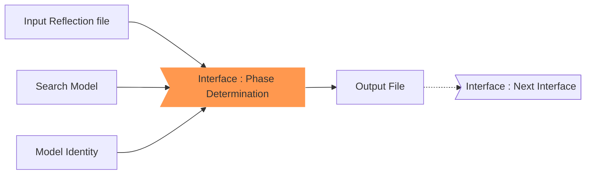
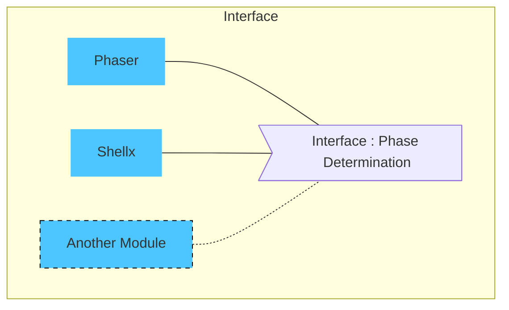
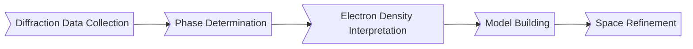
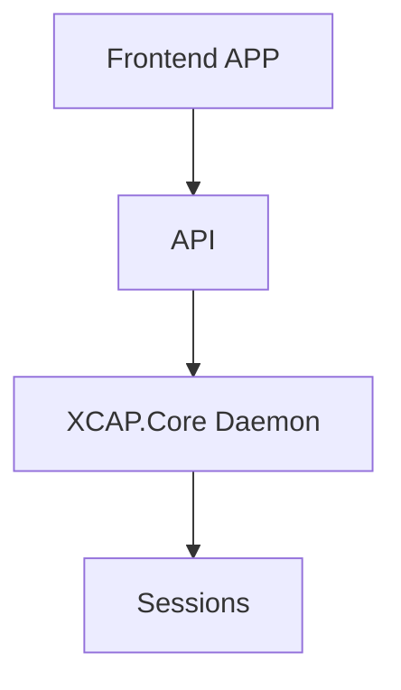
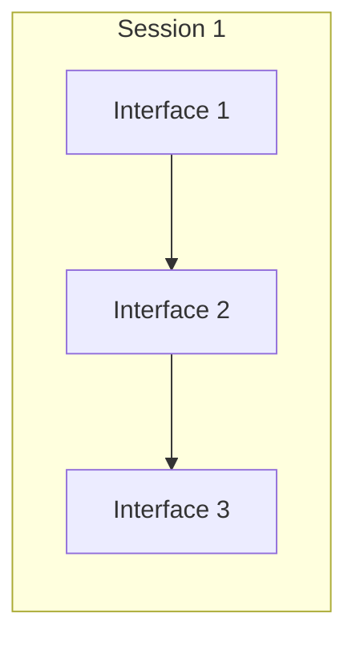

# Table of Contents

| No | Content |
|--|--|
| 1. | [Introduction and overview](/index.html)  |
| 2. | [X-Ray Crystallography](/crystallography.html) |
| 3. | [Design](/designDecisions.html) |
| 4. | [Contribute to the project](/contributing.html)|
| 5. | [Development Guide for Crystallographers](/devlopmentGuideForCrystallographers.html) |
| 6. | [Development Guide for Software Developers](/devlopmentGuideForSoftwareDevelopers.html)
| 7. | [Known Issues](/issues.html)
| 8. | [Important Links](/links.html)
| 9. | [Contacts](/contacts.html)

# XCAP Introduction

$$
\Rho(x,y,x) = \frac{1}{V} \sum_{-h}^h\sum_{-k}^k\sum_{-l}^l F_{hkl} .\exp[-2\pi i(hx + ky + lz - \alpha_{hkl})]
$$
*Almost all aspects of life are engineered at the molecular level, and without understanding molecules we can only have a sketchy understanding of life itself. - *Francis Crick**

**X**ray **C**rystallography and **A**nalytics **P**ipeline, **XCAP** is a project to reimagine the crystallography tools in a modern, state of the art computer world. We are a group of software developers working continuously with crystallographers, biochemists and research scientists to architect, write and build an automation pipeline taking advantage of modern concepts like containerization, microservices, graph APIs with the philosophy of DevSecOps in the core.

On the first phase, the primary objective of the project is to collect, link and bridge different crystallography tools that are available under a single framework to provide easier usability by developing intuitive user interfaces and CLI tools, better security by implementing industry-standard protocols, scalability by opening up standard APIs, enabling every stakeholder in the crystallography and drug discovery world to focus on what they do best.

# Project Status

 # Technology Used
 
|  |  |
|--|--|
 | Backend | Go |
 | Frontend | React.js |
 | Containerizaton (Microservices) | Docker |
 | Containerizaton (Wrapper) | LXC/LXD |
 | Developement Pipeline | Chef, InSpec |
 | API | GraphQL |
 | MessageQ | RabbitMQ |
 | Database | MySQL, Mongo |
 | Supported Auth | DB Connectores, LDAP, SSO |
 | Storage Backend | ZFS (Preffered), NFS |
 | Targeted OS | UNIX Like |
 | Wrappers | HKL, CCP4, Phenix and more|
  
  > **Note:** The project does NOT distribute binaries of HKL, CCP4, Phenix or any other tools that are/might be required to run parts of the project. These tools must be installed by the user/administrator on a system as per their license agreement and citation requirements specified on their respective website. Once installed, the tools can be linked to the framework by a config file. 

# High-level Technical Overview

The core idea of the project revolves around modularity. 
### Interfaces

The pipeline declares '**interfaces**' (or stages) in a workflow. In general, an [interface](https://en.wikipedia.org/wiki/Interface_%28computing%29) is a shared boundary across which two or more separate components of a computer system exchange information. The interfaces specify a set of protocols that needs to be followed for the exchange to happen. 
An *example* will be a "Music Player".  For anything to be called as a music player, it at least should have a play, pause, stop control and an output jack for an aux device. This set of the specification is given by the music player interface. The interface does not look further on how things are implemented beneath it. Another example in the crystallography world is the 'Phase Determination` Interface. The interfaces specify that it requires an input reflection file, a search model, model identity to construct an electron density model as output. 
### Modules

The interface is implemented in **modules**.  The modules are where the heavy work is done and the logic is built. An mp3 player, a cassette player, a boombox, an iPod, all are modules to the interface Music  Player.
Similarly, Phenix.phaser that does molecular replacement and ccp4.SHELX can be example modules for the phase determination interface.
An interface can have multiple modules. In other words, various modules that obey that specific interface can be plugged in.

### Dataflow
The xcap.core bridges interfaces as specified to form a workflow. Bridged interfaces should be compatible with each other.

# Software Architecture

<!--stackedit_data:
eyJoaXN0b3J5IjpbOTQyNzg3OTMsNTQ1MDg4MzgzLDU1MzY2NT
Y2NiwtMTY2MDgwNTM5N119
-->